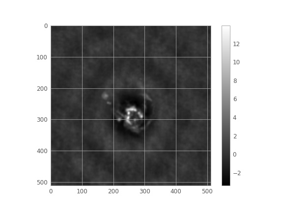

# Cuda Radio Interferometer Gridder - cuRIG

## Introduction
CuRIG is a CUDA-based package for non-uniform Fourier transforms. The package refers to the function definitions of Nifty Gridder in order to make the code portability in RASCIL as easy as possible. We have implemented two main functions of Nifty Gridder such as ms2dirty and dirty2ms. Compared with the CPU parallel version, cuRIG significantly improves the processing performance and can effectively improve the performance of non-uniform FFT in radio astronomical interferometer data processing.

In the current version, we use ES kernel functions in NUFFT and improved W-stacking in imaging.

-- HKUST & GZHU Joint Group，2021

## Installation

### Requirement
- CUDA Toolkit
- GCC

### Procedure
1. Get the code in this repository
```
git clone https://github.com/astronomical-data-processing/cuRIG.git
```
2. Revise cuda toolkit path and GPU compute architecture in Makefile
    - add ```/your_path/cuda``` at line 22
    - set the correct compute architecture at line 8 (sm_70 for V100, sm_80 for A100)
3. Compiling and library creating: ``` make ``` (If you are python user, jump to python interface.)
4. Running and testing\
    All the executable files are in the bin folder. (If you are a python user, directly skip to Python interface.)\
    For TESTING,\
    4.1 NUFFT: convolution, nufft and dft can be tested by typing ```make checkconv``` and ```make checkfft``` respectively.\
    4.2 Radio astronomical imaging: w stacking testing and explicit testing are provided. (```make checkwst``` and ```make explicit_gridder_test```).

### Python interface
Currently, we bind cuda and python simply by ctype. After generating the library by compiling, packages like pycuda, six and numpy are required. You can install those packages and our package (curig) by ```pip install .```.

The APIs:
```
dirty = ms2dirty(uvw, freq, ms, wgt, dirty, fov, epsilon, sigma)
```
```
ms = dirty2ms(uvw, freq, ms, wgt, dirty, fov, epsilon, sigma)
```
uvw - 2d array storing coordinates of visbility, freq - freqency, ms - visibility value (complex number), wgt - weight, dirty - dirty image, fov - field of veiw, epsilon - the tolerance and siamg - upsampling factor.

After the previous setting, you could test by running test_w.py.

## Demo result
Here shows a dirty image generated by real data.

## Reference
* [Gridding kernel] (https://arxiv.org/abs/1808.06736)
* [Improved WS] (https://arxiv.org/pdf/2101.11172.pdf)